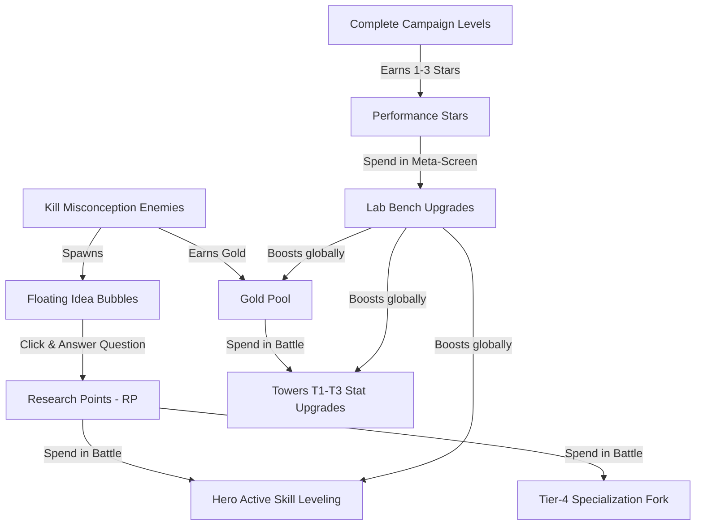
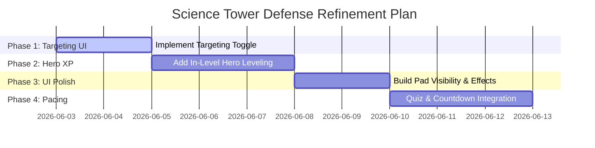

# Science Tower Defense: Comprehensive Industry Comparison & Strategic Improvement Report

## 1. Executive Summary

This report evaluates **Science Tower Defense** (our browser-based HTML5/JS tower defense game) against the mechanics, progression loops, economies, and UI paradigms of the genre's leading titles: **Kingdom Rush** (Ironhide Game Studio), **Bloons TD 6** (Ninja Kiwi), **Realm Defense** (Babeltime), and **Arknights** (Hypergryph). 

Through this analysis, we identify how the classic "secret sauce" of these titles—interlocking tactical economies, high-stakes choke-point stalling, dynamic deployment strategies, and deep meta-progression—can be used to elevate *Science Tower Defense* from an educational browser game to a highly engaging, polished strategic experience.

---

## 2. Deep Dive Research: Genre Leaders

To establish a baseline for comparison, we examine the load-bearing pillars of the four most popular and commercially successful tower defense titles in modern gaming history.

### 2.1 Kingdom Rush Series
The *Kingdom Rush* franchise defined the modern mobile/PC tower defense layout, built around tight, micro-tactical pathing and active battlefield management.

*   **The 4-Tower Archetype system**: Every level starts with four base towers representing distinct strategic roles: Archer (cheap rapid physical), Mage (high-damage armor-melting magic), Artillery (slow high-AoE ground), and Barracks (melee blocker). 
*   **Branching Specialization**: Towers are upgraded linearly to Tier 3. At Tier 4, the player chooses between two distinct specializations (e.g., Archer splits into Ranger with poison/vines or Musketeer with long range/instakill). Each specialization features 2–3 active abilities that can be upgraded with gold, turning towers into highly customized defensive hubs.
*   **The Barracks & Blocking Paradigm**: Ground enemies must be physically stopped to maximize the efficiency of Artillery and Mage AoE damage. Barracks spawn three mobile soldiers who engage in melee combat, stalling creeps. These troops can be rallied to any spot within a radius, allowing players to create dynamic "kill zones."
*   **Tactical Pacing**: Players can call incoming waves early using a prominent skull button, rewarding them with gold bonuses. Spells (Rain of Fire, Reinforcements) operate on long cooldowns, giving the player direct emergency tools to handle leaks.

### 2.2 Bloons TD 6 (BTD6)
Ninja Kiwi's flagship title represents the pinnacle of stat-based tower customizability, long-term meta-progression, and complex scaling.

*   **Deep Crosspathing (5-2-0 / 0-2-5)**: BTD6 features 22+ towers (monkeys) divided into Primary, Military, Magic, and Support. Each monkey has three upgrade paths with 5 tiers. A player can upgrade one path to Tier 5, a second path to Tier 2 (the "crosspath"), and the third path is fully locked. This results in hundreds of unique combat profiles per monkey.
*   **Automated Hero Leveling**: Players select one Hero before entering a map. Heroes gain experience automatically at the end of each round, leveling up from 1 to 20. High-level heroes gain active abilities (usually unlocked at level 3 and 10). Players can also spend in-game cash to "force-buy" hero levels instantly.
*   **Highly Custom Targeting Modes**: Towers feature selective targeting UI: **First** (closest to exit), **Last** (closest to entrance), **Close** (closest to tower), and **Strong** (highest HP/layer). High-tier monkeys also gain specialized modes like **Submerge**, **Pursuit**, or **Target Independent**.
*   **Account Leveling & Monkey Knowledge**: A massive metagame tree lets players spend points to unlock permanent passive boosts across all runs (e.g., "+200 starting cash," "Heroes start at level 3").

### 2.3 Realm Defense: Hero Legends TD
Babeltime's title adapted the *Kingdom Rush* blueprint into a highly optimized F2P mobile model, introducing multi-hero coordination and live campaign progression.

*   **Multi-Hero Lineups**: Players deploy up to three Heroes simultaneously. Heroes act as mobile blocking towers, casting automated skills and moving freely to intercept breaches.
*   **Awakening and Elixir Progression**: Outside battles, heroes are leveled up using Elixir (generated passively via a mine) and ranked up (R0 to R7) using Awakening Tokens. Ranks unlock specialized passive traits, stats, and active abilities.
*   **World-Locked Tower Pools**: Each thematic World (campaign chapter) features exactly four towers unique to that environment. World 1 towers are completely different from World 6 towers, ensuring that players must continuously learn new strategies rather than relying on a single dominant defense.

### 2.4 Arknights
Hypergryph's RPG-TD hybrid introduced a grid-based deployment layout focused entirely on character (Operator) deployment, directional targeting, and active blocking.

*   **Deployment Points (DP) Economy**: Unlike gold-on-kill economies, Arknights operates on DP. DP generates passively at 1 DP/sec. High-cost operators (Defenders, Casters) cannot be placed early. Players must deploy cheap **Vanguards** early to block initial waves and actively generate DP through their skills.
*   **Directional Grid Deployment**: All units are placed on a square grid and must be oriented in one of four directions (North, South, East, West). Ranged units only fire within their specific oriented cone, requiring careful planning of directional overlaps.
*   **Strict Blocking Counts**: Blocking is an individual operator statistic (typically 1 to 3). Melee units hold enemies in place up to their block limit. Any excess enemies bypass them completely, creating intense choke-point lane pressure.
*   **Active Skill Triggers**: Operators are developed outside battles through leveling, promotions (Elite 1/2), and masteries. During battles, players choose which of the Operator's 1-3 active skills to bring, triggering them manually based on SP (Skill Points) accumulated through time or attacks.

---

## 3. Comparison Matrix: Science TD vs. Industry Leaders

The following table summarizes the structural, tactical, and progressional differences between *Science Tower Defense* and the genre leaders.

| Design Axis | Kingdom Rush Series | Bloons TD 6 | Realm Defense | Arknights | Science TD (Our Game) |
|---|---|---|---|---|---|
| **Tower Roles** | 4 Base Archetypes + 2 Branches at Tier 4. Active abilities. | 22 Monkeys, three 5-tier paths. Deep crosspathing. | 4 World-locked towers, Tier-4 branching. | 8 Classes (Vanguard, Defender, Caster, etc.) with custom subclasses. | 5 Ranged disciplines + 1 Barracks blocker. 2-way Branching at Tier 4. |
| **Upgrade Choices** | Flat linear upgrades; abilities bought at max tier. | Modular crosspaths (5-2-0, 0-2-5, etc.). | 5–7 purchase steps per tower; binary forks. | Developed out-of-battle (Elite promotion, skill Masteries). | Unique mechanic per stat (+Atk speed -> slow, +Damage -> pierce). |
| **Hero Mechanics** | 1 Hero per level, levels up inside level (max lvl 10), respawns. | 1 Hero, auto-levels 1–20, active skill cooldowns, cash buyout. | Up to 3 Heroes, tap-to-move, auto-revive on early-wave call. | Every character is a Hero (Operator); manually triggered SP skills. | Up to 2 Heroes, tap-to-move, auto-revive on early-wave call, passive auras. |
| **In-Level Economy** | Gold (kills/early call) for towers. | Cash (pops/end-round) for towers/heroes. | Coins (kills/early call) for towers. | **Deployment Points (DP)** generated passively + Vanguard skills. | **Gold** (kills) for towers; **Research Points (RP)** (quiz answers) for spec/skills. |
| **Meta-Progression** | Stars spent on a resetting global upgrade tree. | Monkey Knowledge tree; Hero unlocks; Trophy Shop. | Gems, Elixir mine, awakening ranks, resetting Star upgrades. | Extensive RPG system: Operator promotions, Base building, materials farming. | **Stars** (1–3 per level) spent on permanent Lab upgrades (resettable). |
| **Targeting Controls** | None (automatic smart-targeting). | First, Last, Close, Strong, Manual Reticle. | None (automatic smart-targeting). | Automatic (based on subclass targeting priorities e.g., flyers first). | Automatic (Strongest for Physics; First for others). No player controls. |
| **Road & Blocker Rules** | Dedicated Barracks towers place blocking troops on paths. | No blockers. Ranged slow/stun only. | Melee heroes + Barracks towers block ground paths. | Melee units block 1-3 ground units directly on grid paths. | 1 Barracks tower; Heroes & summons act as blockers. SNAP to fixed spots. |
| **Educational Hook** | None. | None. | None. | None. | **Primary core loop**: Pop quiz bubbles to earn RP, gate specializations. |

---

## 4. Current Architecture & Strengths

Our implementation of *Science Tower Defense* has established a robust foundation that successfully merges high-fidelity strategic play with syllabus-focused educational mechanics.

### 4.1 Interlocking Gameplay and Currency Flow
Our game achieves a elegant loop by coupling three distinct currencies:

### 4.2 Mechanical Highlights of Our Game
*   **The Triple-Axe Stat Upgrades (Task B)**: Instead of generic numerical bumps, upgrading a specific stat unlocks a gameplay mechanic. This represents a highly innovative approach to in-battle upgrades:
    *   **+Damage** grants `armorPierce` (ignores physical/energy resistances).
    *   **+Range** grants `prioritizeFar` (changes targeting to focus on the furthest-along/highest-HP enemy) and applies soft-capped diminishing range returns.
    *   **+Speed** grants `slowOnHit` (attacks apply a movement speed debuff).
*   **Counter-Tactics Web (Task A)**: Enemies feature strategic flags (`flying`, `armored`, `shielded`, `healer`, `fast`) that map directly to tower attack properties:
    *   **Chemistry (Acid)** melts `armored` Flat Earthers but is ground-only and cannot hit `flying` Geocentric Myths.
    *   **Physics (Energy)** deals high burst to crack `shielded` Perpetual Motion enemies.
    *   **Biology (Physical)** rapid-fires spores to clear `fast` Caloric swarms.
*   **Procedural Vector Fallbacks**: The code utilizes a dual-rendering engine. If high-fidelity PNG assets are absent in iCloud sandbox directories, it falls back to dynamically drawn procedural shapes (e.g., spinning flat globes for Flat Earth, heat shimmers for Caloric), ensuring a crash-proof runtime.

---

## 5. Factual Gap Analysis: How We Can Improve

Despite these strengths, comparison with industry standards reveals four primary strategic gaps in our game's current design.

### 5.1 Gap 1: Ranged Targeting Control (The "Sniper Lock" Problem)
*   **Factual Issue**: High-tier towers (especially the Physics "Railgun" specialization, which deals $3.8\times$ base true damage) are balanced around target selection. In our code, `PhysicsTower` default targeting is hardcoded to `"strongest"`. While useful, as waves clump, players cannot change targeting to catch escaping low-HP runners or focus down a healer enemy at the back. BTD6 solves this with the targeting selector UI.
*   **Improvement Path**: Introduce a clickable targeting toggle (`First / Last / Close / Strong`) on the tower upgrade menu.

### 5.2 Gap 2: Static Hero Progression during Battles
*   **Factual Issue**: Our heroes (Einstein, Newton, Curie, Darwin) start each round with static statistics (HP, damage, range) and only receive boosts from global star upgrades. In both *Kingdom Rush* and *Bloons TD 6*, heroes are dynamic entities that earn experience points (XP) from enemy defeats, growing in power and altering their visual sprites as the run escalates.
*   **Improvement Path**: Integrate an in-level Hero XP bar. Earning XP from enemy pops raises the Hero's level (1 to 5) during the run, scaling damage/HP and unlocking passive upgrades.

### 5.3 Gap 3: Fixed Build Pad UI Clarity
*   **Factual Issue**: While we successfully implemented snap-to-pad mechanics (preventing path building), the build pads themselves are only visible *after* a player clicks a tower shop button. Players who are scanning the map to plan their defense layout see an empty background and must guess where build zones are.
*   **Improvement Path**: Render faint, low-opacity dashed markers for empty pads when no tower is selected, popping them into bright green glowing circles only when placement mode is activated.

### 5.4 Gap 4: Educational Pacing & Question Overload
*   **Factual Issue**: Currently, "Idea Bubbles" drift across the screen during the heat of active battles. Forcing the player to read, analyze, and answer multiple-choice questions while micro-managing a hero and defending against fast caloric swarms creates severe cognitive overload. This leads to players either ignoring the bubbles (losing out on crucial RP) or pausing the game, disrupting the combat pacing.
*   **Improvement Path**: Transition the core quiz loop into the **"Between-Wave Setup Phase"** and the **"Early Call" mechanics**:
    *   Answering a question successfully during the between-wave countdown instantly calls the wave and doubles the early-call gold bonus.
    *   Restricting floating bubbles to lower frequencies or passive phases, ensuring the action remains clean.

---

## 6. Actionable Implementation Path

To address these gaps and bring *Science Tower Defense* up to industry-defining standards, we propose a four-phase expansion plan. These improvements can be written cleanly into our existing ES6 vanilla JS modules.

### 6.1 Phase 1: Interactive Ranged Targeting Modes
Extend the tower menu to allow player-controlled targeting overrides.

1.  **Code Modifications (`js/towers.js`)**:
    *   Add a `cycleTargetMode()` method to the base `Tower` class: `['first', 'strongest', 'weakest', 'closest']`.
    *   Expose `targetMode` to the UI.
2.  **UI Modifications (`index.html` / `style.css`)**:
    *   In the bottom upgrade drawer (`#tower-upgrade-menu`), add a glowing target selector button.
    *   Draw the active mode: `🎯 Target: First` (or Strongest/Weakest/Closest).
3.  **Targeting Resolution**:
    *   Update `findTargets()` to read the user-selected mode dynamically on every fire tick.

### 6.2 Phase 2: In-Battle Hero XP & Level Scaling
Make heroes feel alive by allowing them to grow in power dynamically during a run.

1.  **Code Modifications (`js/heroes.js`)**:
    *   Add `this.xp = 0`, `this.level = 1`, and `this.xpNeeded = 100` to the base `Hero` constructor.
    *   Add an `addXp(amount)` method. When leveling up, spawn a gold star particle burst and scale `this.damage` and `this.maxHealth`.
    *   Give heroes special visual indicators at level 3 and 5 (such as glowing particle trails).
2.  **Triggering XP (`js/game.js`)**:
    *   Inside `Enemy.takeDamage()`, if the damage source is a Hero (or within a Hero's attack range), distribute XP proportionally to the Hero.
3.  **HUD Addition**:
    *   Render a slim, glowing purple XP bar directly beneath the Hero's health bar on the canvas.

### 6.3 Phase 3: Fixed Build Pad Visual Polish
Enhance map planning by giving players clear visibility of strategic terrain before purchasing.

1.  **UI Rendering (`js/levels.js`)**:
    *   Modify `LevelManager.drawBuildSpots()`. When no tower is selected, render unoccupied spots as faint, pulsing blueprint gear shapes (with a low opacity of `0.15`).
    *   When the player enters build mode, fade these gears into high-visibility glowing green pads with rotating circular rings.
2.  **Visual Snapping**:
    *   Draw a dashed line connecting the player's cursor to the snapped build pad, providing immediate feedback on snap zones.

### 6.4 Phase 4: Harmonized Educational Pacing
Seamlessly bind the quiz mechanics to combat downtime, reducing stress while preserving the educational value.

1.  **Strategic Wave Calling (`js/game.js`)**:
    *   When the between-wave countdown starts, a "Solve to Rush" prompt appears.
    *   Clicking the prompt launches a syllabus question.
    *   Answering **correctly** instantly calls the next wave, heals heroes, and grants a **Double Early-Call Gold Bonus** ($16\text{g}/\text{sec}$ skipped instead of $8\text{g}$).
    *   Answering **incorrectly** simply restarts the countdown with no penalty, ensuring the gameplay flow is never disrupted.
2.  **Research Lab Meta-Screen Integration**:
    *   Allow players to view the fully unlocked Bestiary from the main menu, linking to short syllabus explanations of the science facts that correct the misconceptions represented by the enemies (e.g., explaining why spontaneous generation was disproven by Pasteur).

---

## 7. Strategic Synthesis

> [!NOTE]
> *Science Tower Defense* already possesses premium mechanics—such as branch specializations, anti-stacking penalties, and multi-stage creeps—that equal or exceed basic mobile clones.

> [!TIP]
> By executing the **Targeting UI** and **Harmonized Educational Pacing** refinements, we can remove the cognitive stress of mid-wave quizzes while significantly deepening the player's tactical control over the battlefield.

> [!IMPORTANT]
> The dual-rendering system remains a critical architectural asset. As premium PNG assets (sprite sheets and painted terrain maps) continue to be developed and loaded from sandbox directories, the game will seamlessly transition from a vector-based layout to a professional cartoon aesthetic without requiring core code rewrites.
